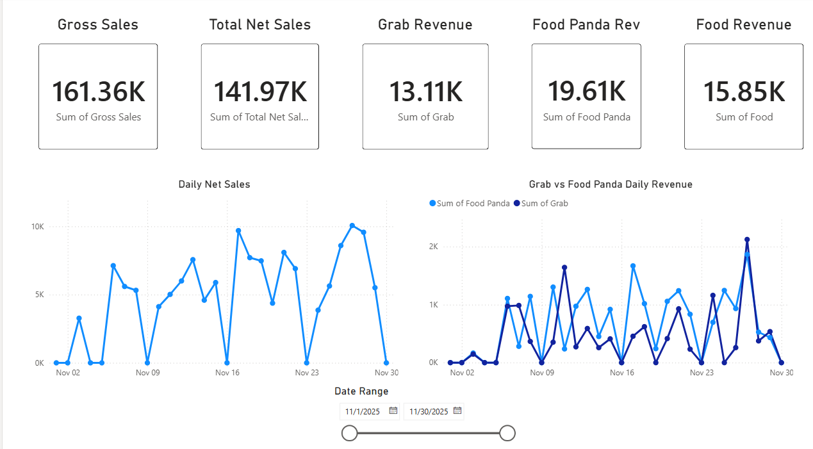

# Power BI Daily Sales Dashboard

An interactive Power BI dashboard built to analyze daily sales performance for a retail coffee chain.  
The dashboard is designed to scale across **any month or date range** and supports ongoing data refreshes as new sales data becomes available.

---

## 📊 Dashboard Overview

This dashboard provides a high-level view of sales performance along with channel-level comparisons and daily trends.

---

## 📌 Key Metrics (KPIs)

The dashboard tracks the following core KPIs:

- **Gross Sales**
- **Total Net Sales**
- **Grab Revenue**
- **Food Panda Revenue**
- **In-store Food Revenue**

These KPIs automatically update based on the selected date range.

---

## 📈 Visualizations

- **Daily Net Sales Trend**  
  Line chart showing net sales performance by day

- **Grab vs Food Panda Daily Revenue**  
  Side-by-side comparison of third-party delivery platforms

- **Dynamic Date Slicer**  
  Enables analysis for any completed or in-progress month

---

## 🧹 Data Preparation & Modeling

- Source data originated from **daily sales reports** with inconsistent formatting and excess columns
- Cleaned and transformed using **Power Query**
- Reduced **200+ raw columns** into a KPI-focused analytical model
- Created calculated measures and date logic to support time-based analysis

---

## 🗂️ Repository Contents

